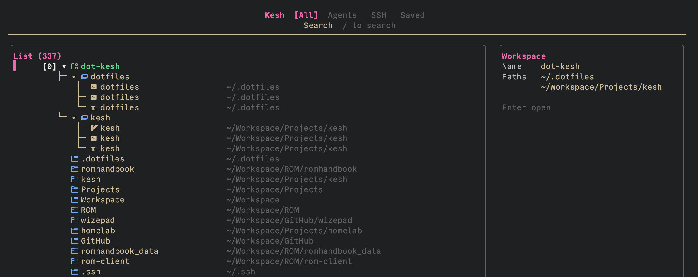
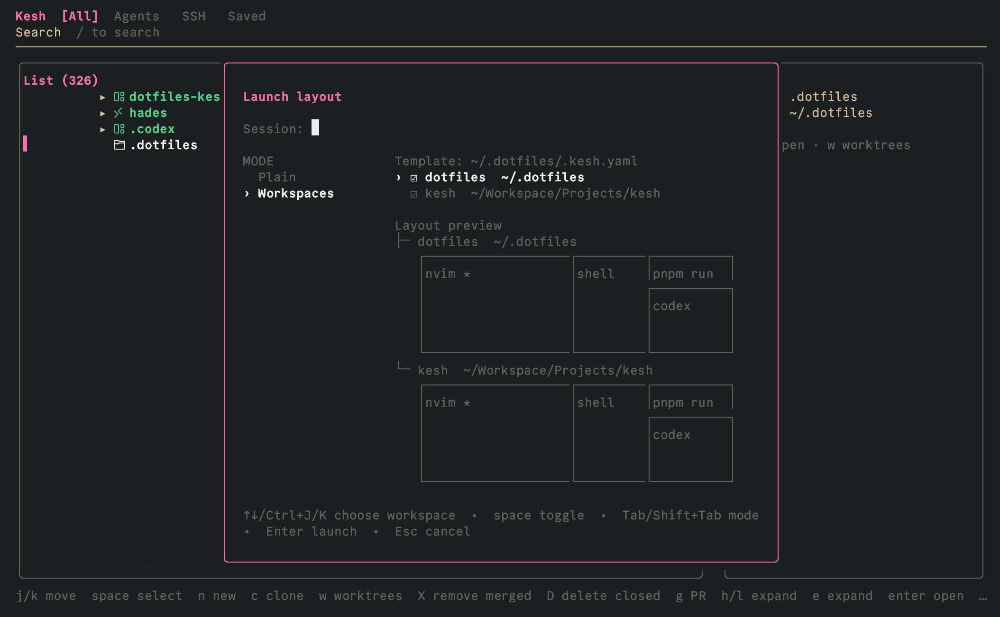

# kesh

kesh is a keyboard-driven [Kitty](https://sw.kovidgoyal.net/kitty/) session manager,
powered by [Kitty session](https://sw.kovidgoyal.net/kitty/sessions).



## Features

- **Keyboard-driven Kitty picker** — browse and switch projects, sessions, tabs, windows, SSH hosts, and saved layouts.
- **Project layouts** — define workspaces, panes, startup commands, and worktree setup in `.kesh.yaml`.
- **Zoxide integration** — discover and open your frequently used projects quickly.
- **Save and restore sessions** — build on Kitty’s [session support](https://sw.kovidgoyal.net/kitty/sessions/) to save tabs, splits, and working directories, with optional foreground command restoration.
- **Git worktrees and pull requests** — create worktrees, clone repositories, and check out GitHub pull requests.
- **Native Kitty pins** — assign Kitty shortcuts to sessions during the current Kitty run.
- **Agent visibility** — find active `Codex`, `Claude` and `pi` windows with live terminal previews.

## Why Kitty instead of tmux?

kesh is built around Kitty’s native workspace features rather than a terminal
multiplexer. I used [sesh](https://github.com/joshmedeski/sesh) heavily in the
past, and kesh grew from wanting similar project and session discovery while
using Kitty directly.

tmux remains a better choice for terminal-agnostic or headless workflows,
especially on remote servers. It can keep a background session alive so you can
detach and resume running processes later. kesh intentionally does not provide
that behavior because I don't need such feature for my local machines.

## Install

```sh
brew install alienxp03/tap/kesh
```

## Requirements

| Dependency | Status | Used for |
| --- | --- | --- |
| [Kitty](https://sw.kovidgoyal.net/kitty/) | **Required** | Running kesh and opening workspaces; remote control must be enabled below |
| [Git](https://git-scm.com/) | **Required for Git features** | Cloning repositories, Git worktrees, and repository metadata |
| [zoxide](https://github.com/ajeetdsouza/zoxide) | Optional | Frecency-ranked project discovery; without it, Kitty, saved-session, and SSH sources still work |
| [GitHub CLI (`gh`)](https://cli.github.com/) | Optional | GitHub pull-request status and the `C` checkout action; run `gh auth login` first |
| OpenSSH client (`ssh`) | Optional | Opening configured SSH hosts |

The `c` clone action uses `git clone` directly; `gh` is not required for ordinary
repository cloning. GitHub PR checkout and status features do require `gh`.

## Kitty setup

kesh controls Kitty through remote control. Add this to `kitty.conf`:

```conf
allow_remote_control yes
listen_on unix:/tmp/kitty
enabled_layouts splits,stack

map cmd+shift+o launch --type=overlay kesh
```

Reload Kitty after changing its configuration. Keep `splits` first and do not
add layout options such as `split_axis`: Kitty rebuilds and flattens live split
trees when an option-bearing layout is reloaded. Kesh pins the same option-free
layout list in generated sessions. You can also start kesh from
a shell by running:

```sh
kesh
```

## First use

1. Open kesh with `cmd+shift+o`, or run `kesh` from a shell.
2. Select a project and press `enter`.
3. Use `l` and `h` to move through sessions, tabs, and windows.

## Common keybindings

| Key              | Action                                                          |
| ---------------- | --------------------------------------------------------------- |
| `enter`          | Open, focus, or restore the selected item                       |
| `n`              | Create a named session; use `space` to select multiple projects |
| `o`              | Open a project with its configured `.kesh.yaml` layout          |
| `s`              | Save the current layout                                         |
| `S`              | Save the layout and restart foreground commands when restored   |
| `w`              | Open worktrees from a window or unopened project folder         |
| `c`              | Clone a repository                                              |
| `C`              | Check out a GitHub pull request                                 |
| `p` then `0`–`9` | Pin a session                                                   |
| `r`              | Rename a session, tab, or window                                |
| `x` then `y`     | Close or remove the selected item                               |
| `?`              | Show all keymaps                                                |
| `q`              | Quit                                                            |

### Saved sessions

Press `s` on an open session to save its tabs, splits, and working directories.
Use `S` when you also want kesh to capture the foreground commands. Be careful:
restoring the session can run those commands again. See Kitty's
[`--use-foreground-process` documentation](https://sw.kovidgoyal.net/kitty/sessions/#the-save_as_session-action)
before using it with commands that have side effects.

Saved sessions remain in the list after Kitty closes. Select one and press
`enter` to restore it.

### Worktrees

Press `w`, then `n`, to create a branch worktree. kesh opens it in Kitty and
uses the project layout when one is configured.

### Agents

Run `kesh agents` to list active Claude, Codex, and pi windows. Press `enter`
to focus one and `p` to show its live terminal preview.

## Project configuration



This is useful when you are working on multiple projects at the same time.
For example, you have `backend` and `frontend` that are in separate repositories.

Run this from a project root:

```sh
kesh init
```

This creates `.kesh.yaml`. A minimal layout looks like this:

```yaml
workspaces:
  - name: backend
    repo: .
    panes:
      - commands:
          - nvim
        focus: true
      - commands:
          - pnpm run dev
        split: horizontal
      - split: horizontal
```

### Multiple repositories

For a layout spanning separate repositories, add another workspace. Paths are
relative to `.kesh.yaml`; this example assumes `frontend` is next to `backend`:

```yaml
workspaces:
  - name: backend
    repo: .
    panes:
      - commands:
          - nvim
        focus: true
      - commands:
          - pnpm run dev
        split: horizontal
  - name: frontend
    repo: ~/Workspace/frontend
    panes:
      - commands:
          - nvim
        focus: true
      - commands:
          - pnpm run dev
        split: horizontal
```

`workspaces` can describe multiple repositories. `panes` defines the tabs and
splits kesh opens.

### Worktree setup

Worktree settings run once when creating a worktree with `w`, then `n`. Shared
defaults can copy files into every worktree; workspace-specific settings can
also symlink files and run post-create hooks:

```yaml
worktree:
  defaults:
    files:
      copy:
        - .env

workspaces:
  - name: backend
    repo: .
    worktree:
      files:
        symlink:
          - .env.local
      hooks:
        post_create:
          - pnpm install
```

Other setup options include randomized ports and generated environment values.
These settings do not run when opening an existing folder.

Global paths and default Kitty startup sessions are configured in `~/.config/kesh/config.yaml`:

```yaml
clone:
  root: ~/workspace # repository clones and PR checkouts
worktree:
  root: ~/workspace/worktrees # PR worktrees

startup:
  sessions:
    - name: backend
      path: ~/workspace/backend
      pin: 0
    - name: frontend
      path: ~/workspace/frontend
      pin: 1
```

Run `kesh start` to launch the configured sessions in the current Kitty OS
window. A path with `.kesh.yaml` uses its configured layout and workspaces; a
path without one opens as a plain folder session. Startup refuses to run when
named Kitty sessions already exist, preventing a partial or duplicated launch.

## Manual Kitty sessions

kesh does not replace Kitty's native session files. If you use a Kitty mapping
such as:

```conf
map ctrl+b>k goto_session ~/path/to/project.kitty-session
```

that session appears in kesh automatically while it is open. Closed manual
Kitty sessions remain available through Kitty's own mapping; use kesh's `s` if
you want the session to remain restorable in the kesh list.

## Pins

kesh can generate native Kitty shortcuts for pinned sessions. Include the
generated file in `kitty.conf`:

```conf
include ~/.local/state/kesh/kitty-pins.conf

map cmd+0 kesh_pin_0
map cmd+1 kesh_pin_1
map cmd+2 kesh_pin_2
map cmd+3 kesh_pin_3
map cmd+4 kesh_pin_4
map cmd+5 kesh_pin_5
map cmd+6 kesh_pin_6
map cmd+7 kesh_pin_7
map cmd+8 kesh_pin_8
map cmd+9 kesh_pin_9
```

Pins belong to the current Kitty run. kesh clears them when Kitty exits
normally or when it detects a stale Kitty process.

## CLI

```text
kesh                         Open the workspace picker
kesh start                   Launch configured default sessions
kesh init                    Create .kesh.yaml in the current directory
kesh agents                 Show active agent windows
kesh ssh                    Show configured SSH hosts
kesh saved                  Show saved sessions
kesh switch SLOT             Focus pin 0–9
kesh clear-pins              Clear pins
kesh clear-pins --on-quit    Clear pins when Kitty quits
```

## SSH hosts

kesh discovers SSH hosts from `~/.ssh/config`. Add named `Host` entries there;
wildcard-only entries such as `Host *` are not shown as hosts in kesh:

```sshconfig
Host production
    HostName production.example.com
    User stan
    Port 22
    IdentityFile ~/.ssh/id_ed25519
```

Run `kesh ssh` to view only SSH hosts, or select one from the main picker. kesh
launches `ssh` with the host alias, so SSH options such as `User`, `Port`, and
`IdentityFile` continue to be applied by OpenSSH.

## Troubleshooting

### kesh cannot connect to Kitty

Confirm that Kitty contains:

```conf
allow_remote_control yes
listen_on unix:/tmp/kitty
```

Then reload Kitty and run `kesh` again.

## Development

This section is for contributors. End users should install the Homebrew
package above.

```sh
make ci       # format check, lint, tests, and build
make build    # installs the development binary to ~/.local/bin/kesh
make release-dry-run BUMP=patch
make release BUMP=patch                     # prompt before pushing the tag
make release BUMP=minor RELEASE_FLAGS=-y     # publish without prompting
make release VERSION=v1.0.0                  # explicit version
```

See [AGENTS.md](AGENTS.md) for project architecture and contributor
instructions.
